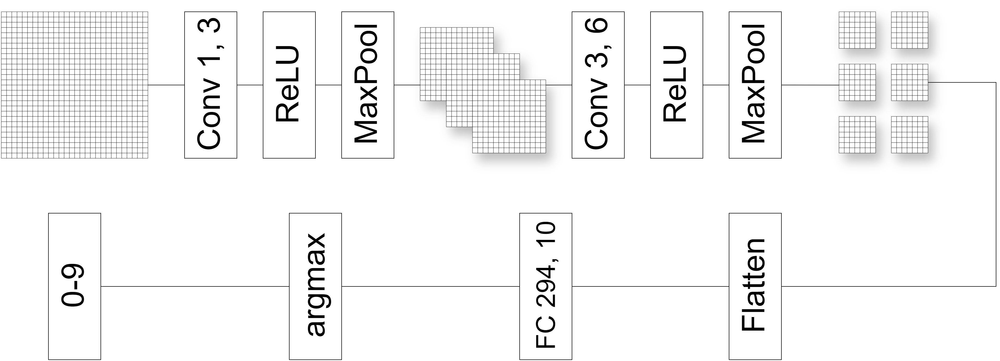

# A test for on chain digit recognition inference

## Run locally
Requirements: Node >= 20

Fill REACT_APP_RPC_URL and REACT_APP_CONTRACT_ADDRESS in .env

```
npm install
npm run dev
```


## Schematic


## Net BackBone



## Contracts (Verified on monadDevnet)

Convolution2D: 0xb08b05A403cDFa8Fd97439ad5a1ac9E80ff77Ad1

FullyConnectedLayer: 0x648D6CEE3CbDEB1EF9afD24b1441f71392Cc2CCf

MNIST NFT: 0x7a198E9ee6628D0122ffAC2F88f5589D276aD80f