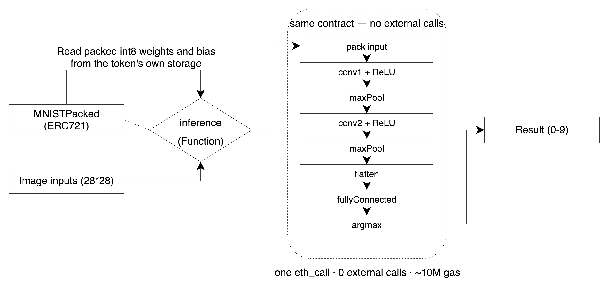
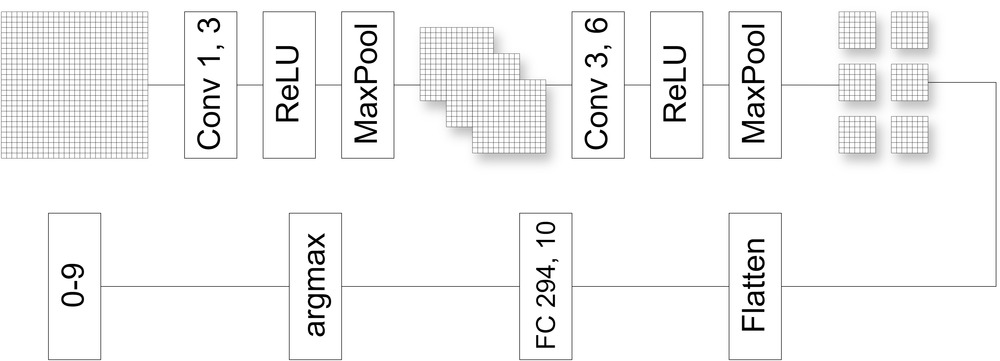

# On-Chain Handwritten Digit Recognition

A small convolutional network whose weights live inside an NFT and whose entire
forward pass — every multiply-accumulate, ReLU, max-pool and argmax — executes
in EVM contracts on Monad. Nothing is computed off-chain.

## Deployments

The model *is* the token: each id holds a different set of weights, and the app
runs whichever one you select. The network picker in the header switches which
chain — and therefore which contract — it reads.

**Monad mainnet** (chainId 143)

| Contract | Address |
| --- | --- |
| `MNISTPacked` | `0x83e765e0b243929c561f9e797fbc0416bcf7044d` |

Deployed and minted from a browser wallet through [`/deploy`](#deploying-from-a-browser-wallet).
Byte-identical to `forge build`'s output. One prediction there is 11.15M gas and
~310 ms.

**Monad testnet** (chainId 10143)

| Contract | Address |
| --- | --- |
| `MNISTPacked` | `0xbb66cc0e2b8de0c8f1542cfec1388fd79106efbf` |

One contract, and it makes no external calls: a prediction is a single
`eth_call` of ~10.2M gas. The three-contract implementation it replaces
(`MNISTNFT` driving `Convolution2D` and `FullyConnectedLayer`, 3,535 external
calls and ~58M gas) is still in `contracts/` and still deployed on both chains,
but the app no longer speaks to it — see [Why one contract](#why-one-contract).

Inference is a `view` call, so the demo needs no wallet, no gas and no
signature. Minting a model does need one.

> Monad's testnet was re-genesised on 2025-12-16, which wiped every contract
> deployed before that date. If the app reports "no contract code", the testnet
> was likely reset again — redeploy and update `.env`.

## Why one contract

`MNISTNFT` gives every activation its own 256-bit word and hands every layer to
another contract, one external call per ReLU included. That is ~58M gas, above
the per-transaction cap of every chain measured, so a prediction there can only
ever be an `eth_call`.

`MNISTPacked` computes the identical function with several activations packed
into each word, one broadcast weight multiplying all of them per `MUL`, and
ReLU folded into the loop that was already running:

| | `MNISTNFT` | `MNISTPacked` |
| --- | --- | --- |
| external calls per prediction | 3,535 | 0 |
| gas per prediction | 57,983,723 | 10,006,912 |
| fits Ethereum / OP / BNB's 16,777,216 cap | no | yes |
| fits Monad's 30M cap | no | yes |

Its storage layout is `MNISTNFT`'s slot for slot, which is what makes the claim
checkable for free: `scripts/verify-packed.mjs` lifts a deployed model's own
slots with `prestateTracer`, replays them under `MNISTPacked` with an `eth_call`
state override, and compares. 192 images — blank, saturated, single-pixel,
corners, dense and sparse noise, random strokes, and inputs scaled to 2^20..2^52
to exercise the 64- and 128-bit lane paths — against an independent JavaScript
reference, against the deployed contract's label, and against its own logits
lifted from its trace. 0 mismatches.

The full measurements, and why Monad's parallelism cannot be spent on a single
prediction any other way, are in
[`docs/multichain-and-parallelism.md`](docs/multichain-and-parallelism.md).

## Run locally

Requires Node ≥ 20.

```
npm install
npm run dev
```

No `.env` is needed to run against the deployments in this repo: each chain
falls back to the address in its `deployments.*.json`. Copy `.env.example` to
`.env` to point at your own instead — one address per chain, and only chains
with an address are offered in the picker:

```
NEXT_PUBLIC_CONTRACT_ADDRESS_143=0x83e7…      # mainnet
NEXT_PUBLIC_CONTRACT_ADDRESS_10143=0xbb66…    # testnet
NEXT_PUBLIC_DEFAULT_CHAIN_ID=143
```

To add a local chain, deploy to anvil (see Workflow below) and put its address
in `.env.anvil` as `NEXT_PUBLIC_CONTRACT_ADDRESS_31337`, then `npm run
dev:anvil`. That file is deliberately not called `.env.local`, which Next.js
would load ahead of `.env` and silently add a local node to every run.

anvil serves `debug_traceCall` and `prestateTracer` too, so the execution view
works unchanged.

The network shown in the UI always comes from the chain id the **node** reports,
never from config — and a write is only allowed when the wallet is on that same
chain. See `lib/chain-gate.ts` and `npm test`; a constant standing in for the
live chain there once sent a real testnet transaction to a local address.

## Quantization

The contracts do **no rescaling between layers** — each layer is a raw integer
accumulate — so scale factors multiply through the network:

```
input    X_int = X_real * 255          (canvas sends 0-255)
conv1    scale = 255 * s1
conv2    scale = 255 * s1 * s2
fc       scale = 255 * s1 * s2 * s3
```

Weights are per-tensor symmetric **int8** (`s = 127 / max|W|`). Each bias must be
pre-scaled to the accumulated scale of the products it is added to; scaling every
bias by a single factor — as the original code did — silently drops the conv2 and
fc biases entirely.

Because nothing is requantized between layers, activations stay full-width
`int256` and grow to ~1e13 by the fc output. This is int8 *weights*, not int8
*arithmetic*: on the EVM every value occupies a 256-bit word and arithmetic costs
the same regardless of magnitude, so quantizing the activations would add work
rather than save it. int8 is used where it does pay — storage.

Weights are packed 32-to-a-word, and the packing happens **client-side** —
`mint` takes `uint256[]` of packed words, not `int[]` of weights. Both halves of
that matter:

| | int256 per slot | packed on-chain | packed client-side |
| --- | ---: | ---: | ---: |
| storage slots | ~3,149 | ~117 | ~117 |
| mint calldata | ~108 KB | ~108 KB | 4.4 KB |
| mint gas | ~74M | ~6.9M | 2.79M |

Mint gas depends on whether the storage slots are fresh: 2.79M when overwriting
an existing model's slots, 4.28M on a first mint into empty ones (20,000 vs
2,900 gas per word).

Sending the weights as `int[]` spends a full 32-byte word on every int8. That is
~1.7M gas of calldata, and — the reason it is not merely wasteful — it exceeds
MetaMask's JSON-RPC request size limit, so minting from a browser wallet fails
with `Request too large` before the transaction reaches the chain.

The int8 range check moves off-chain with the packing; `mint` still validates
that the word count and bias lengths match the declared shapes, so a mis-shaped
upload cannot be stored. `lib/pack.ts` is shared by `scripts/mint.ts` and the
browser, and `scripts/verify.ts` is what proves the packed layout matches what
the contract reads back.

Measured on the full MNIST test set: float 98.09%, int8 98.13%.

## Deploying from a browser wallet

`/deploy` does the same two transactions as the scripts below — deploy
`MNISTPacked`, then mint the weights into it — signed by a connected wallet
instead of by `PRIVATE_KEY`. It exists for the chain where that key has no
funds. Both transactions declare an explicit gas limit and show what they
reserve before you press anything, because Monad bills the declared limit rather
than the gas used; the deployment limit is the estimate itself (creation gas is
exact) and the mint is padded 15% (it writes ~100 slots, and a first mint into
empty storage costs more than a re-mint).

The page fetches `public/MNISTPacked.bytecode.txt` and `public/model-params.json`
rather than bundling them, so regenerate both after recompiling:

```bash
node scripts/gen-deploy-assets.mjs
```

Verified end to end on anvil through the same code path: deploy 3,017,373 gas,
mint 2,926,398, and `inference` on the fresh contract returns the right digit.

## Workflow

```bash
# train, quantize, and write the params JSON
python3 model/train.py

# build a verification fixture (images + the simulator's predictions)
python3 model/make_fixture.py model/checkpoints/<best>.pth 200

# compile
cd model/scripts_for_contracts_and_test && forge build && cd -

# local chain
anvil --gas-limit 2000000000 --block-base-fee-per-gas 0

# regenerate what /deploy serves to a browser wallet (after every forge build)
node scripts/gen-deploy-assets.mjs

# what the app runs: one contract, then a model minted into it
npx tsx scripts/deploy-packed.ts --target anvil
npx tsx scripts/mint.ts --target anvil --contract MNISTPacked \
  --params model/checkpoints/<best>.json

# testnet, then mainnet (--target monad spends real MON)
npx tsx scripts/deploy-packed.ts --target monadTestnet
npx tsx scripts/mint.ts --target monadTestnet --contract MNISTPacked \
  --params model/checkpoints/<best>.json

# prove it computes what the three-contract implementation computes, against a
# deployed address rather than a recompile. Needs no funds and deploys nothing.
node scripts/verify-packed.mjs https://testnet-rpc.monad.xyz <MNISTNFT> <MNISTPacked>

# the three-contract implementation, still deployable for comparison
npx tsx scripts/deploy.ts --target monadTestnet --conv 0x00a8… --fc 0xaa8a…
npx tsx scripts/mint.ts   --target monadTestnet --params model/checkpoints/<best>.json
npx tsx scripts/verify.ts --target monadTestnet --token 1

# list every model minted on the configured contract
npx tsx scripts/registry.ts
```

`model/solidity_sim.py` is a numpy replica of the contract arithmetic, used as a
fast inner loop during training. It is only trusted where `scripts/verify.ts`
shows it agreeing with real bytecode — currently 200/200 on both anvil and
testnet. If they ever disagree, the chain is authoritative.

## Execution trace

Predicting is **one** `eth_call` — `MNISTPacked.inference`, ~10.2M gas, and the
only call on the critical path. There is nothing to trace: the contract makes no
external calls, so a callTracer would report a single frame. Everything the page
draws around the answer is therefore *asked for* rather than lifted out of a
trace, and all of it goes out in parallel after the prediction returns, so the
latency shown is the prediction's own:

| What | How |
| --- | --- |
| the label | `inference()` |
| the scores | `logits()` |
| the activations | `activations(stage)`, `stage` 2..5, unpacked on chain |
| cost per layer | `eth_estimateGas` on `runTo(stage)` for stages 0..7, differenced |

`runTo` runs the first `stage` steps of the pipeline and stops. Stage 0 is
loading and unpacking the model, so the setup every stage shares falls out of
the subtraction. If the RPC will not estimate gas, the prediction still works
and only the breakdown is missing.

Two views are built from that:

- `components/InferenceTrace.tsx` — the activations, layer by layer. Measured,
  not recomputed in the browser.
- `components/ChainExecution.tsx` — the forward pass as a gas budget: one bar,
  eight segments, each the width of what that layer actually costs.

Storage is opt-in, because it costs another execution: `prestateTracer` reports
the 126 words the inference reads out of `MNISTPacked`, where the packed int8
weights live. Cached after the first read — the weights do not depend on the
image.

Execution is replayed, not streamed. Neither Monad nor any other EVM chain
exposes intra-call progress — a call either returns or reverts — so the play
head walks the measured breakdown of the call that already ran, over exactly the
wall-clock that call took. Within that window it advances by **gas**: nothing on
chain records when a layer ran, only what it cost. Per-layer wall-clock is not
measurable from here either — one RPC round trip is longer than the whole
prediction.

Measured gas breakdown of one forward pass (Monad testnet):

| Stage | Gas | Share |
| --- | ---: | ---: |
| `conv2 + ReLU` | 3.53M | 34.3% |
| `conv1 + ReLU` | 3.35M | 32.6% |
| `pool1` | 1.04M | 10.1% |
| `fc` | 701,361 | 6.8% |
| `pool2` | 532,849 | 5.2% |
| load model | 531,133 | 5.2% |
| pack input | 420,559 | 4.1% |
| `flatten` | 167,619 | 1.6% |

For comparison, the same forward pass on the three-contract implementation is
57,983,723 gas, of which `conv2D` alone is 45.57M — ~860 gas per
multiply-accumulate against 8 gas of actual arithmetic, spent on nested-memory
indexing and ABI round-trips. The 3,528 cross-contract `relu` calls, which look
like the obvious problem, were 1.5% of it. See
[docs/onchain-training-research.md](docs/onchain-training-research.md) and
[docs/multichain-and-parallelism.md](docs/multichain-and-parallelism.md).

## Notes on Monad

- Fees are charged on the declared **gas limit**, not gas used, so padding a gas
  limit costs real money. Base fee has been a flat 100 gwei.
- There is a per-transaction gas cap below the 150M block limit; a ~65M-gas
  transaction is rejected with `Exceeds transaction gas limit`.
- `eth_call` allowances are far larger (200M on the public RPC), which is what
  makes a ~60M-gas `inference` view call viable.
- `debug_traceCall` reports the **supplied** gas as the root call's `gasUsed`,
  not the gas consumed — supply 100M and it answers 100M. anvil reports the real
  figure. The UI treats anything at or above the limit as unknown and sums the
  external calls instead.
- `debug_traceCall` and `prestateTracer` both work on the public RPC; `trace_*`
  is not exposed.
- MetaMask caps JSON-RPC request size. It is not a chain limit, but it decides
  what a browser wallet can send: 108 KB of mint calldata is rejected with
  `Request too large` before it reaches the node.
- wagmi's default Multicall3 batching must stay **off** (`batch: { multicall:
  false }`). Routed through Multicall3, the 63/64 gas-forwarding rule starves
  `inference`, and `aggregate3` swallows the failure into a bare revert.

## Schematic



## Net backbone


